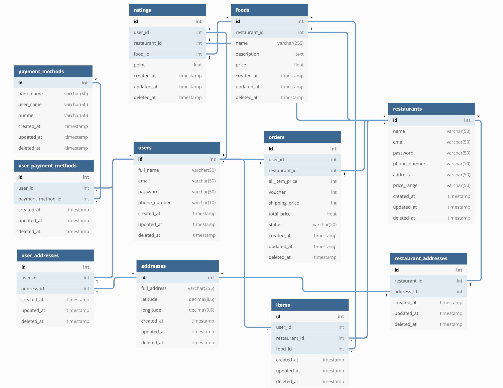

# gin_gorm_apis_001

## Tasks
1. List ra tất cả API cần có trong hệ thống Food Delivery (đúng method, đúng convention và param + data struct nếu có).
2. Thiết lập tất cả table cần có, vẽ diagram với tool học hôm nay.

# DB Diagram

# APIs

User:
    
| API            | Method | URL                     | Notes/TODO              | Done   |
| -------------- |:------:|:------------------------|:------------------------| :----: |
| sign up        | POST   | users                   |                         |   []   |
| sign in        | GET    | users/:usr-id/token     | add token later         |   []   |
| get all        | GET    | users                   | only admin & pagination |   []   |
| get single     | GET    | users/:usr-id           | add token later         |   []   |
| update single  | PUT    | users/:usr-id           |                         |   []   |
| delete single  | DELETE | users/:usr-id           | only admin              |   []   |
| update payment | PUT    | users/:usr-id/payment   |                         |   []   |
| favorite food  | PUT    | users/:usr-id/food      |                         |   []   |
| favorite res   | PUT    | users/:usr-id/res       | restaurant              |   []   |
| rating         | PUT    | users/:usr-id/rating    | rate & review           |   []   |
| address        | POST   | users/address           |                         |   []   |
| payment method | POST   | users/payment-method    |                         |   []   |

Address:
    
| API               | Method | URL                     | Notes/TODO            | Done   |
| ----------------- |:------:|:------------------------|:----------------------| :----: |
| create new        | POST   | addresses               |                       |   []   |
| update address    | PUT    | addresses/:add-id/      |                       |   []   |
| get address       | GET    | addresses/:add-id/      |                       |   []   |
| get all addresses | GET    | addresses               |                       |   []   |

Payment Method:
    
| API               | Method | URL                     | Notes/TODO            | Done   |
| ----------------- |:------:|:------------------------|:----------------------| :----: |
| create new        | POST   | payment-methods         |                       |   []   |
| update address    | PUT    | payment-methods/:pm-id/ |                       |   []   |
| get address       | GET    | payment-methods/:pm-id/ |                       |   []   |
| get all addresses | GET    | payment-methods         |                       |   []   |

Restaurant:
    
| API             | Method | URL                         | Notes/TODO              | Done   |
| --------------- |:------:|:----------------------------|:------------------------| :----: |
| sign up         | POST   | restaurants                 |                         |   []   |
| sign in         | GET    | restaurants/:res-id/token   | add token later         |   []   |
| get res         | GET    | restaurants/:res-id         | add token later         |   []   |
| get all res     | GET    | restaurants                 | only admin & pagination |   []   |
| update res      | PUT    | restaurants/:res-id         |                         |   []   |
| delete res      | DELETE | restaurants/:res-id         | only admin              |   []   |

Food:
    
| API             | Method | URL                         | Notes/TODO              | Done   |
| --------------- |:------:|:----------------------------|:------------------------| :----: |
| create new food | POST   | foods                       |                         |   []   |
| update food     | PUT    | foods/:food-id              | only res admin          |   []   |
| delete food     | DELETE | foods/:food-id              | only res admin          |   []   |
| get all foods   | GET    | foods                       | pagination              |   []   |

Order:

| API            | Method | URL                   | Notes/TODO                      | Done   |
| -------------- |:------:|:----------------------|:--------------------------------| :----: |
| create order   | POST   | orders                |                                 |   []   |
| get order      | GET    | orders/:ord-id        |                                 |   []   |
| cancel order   | PUT    | orders/:ord-id        | only user                       |   []   |
| update order   | PUT    | orders/:ord-id        | accept/reject order, only res   |   []   |
| report bad ord | PUT    | orders/:ord-id/report | something wrong happens         |   []   |
